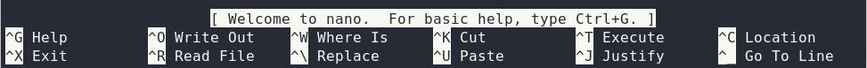
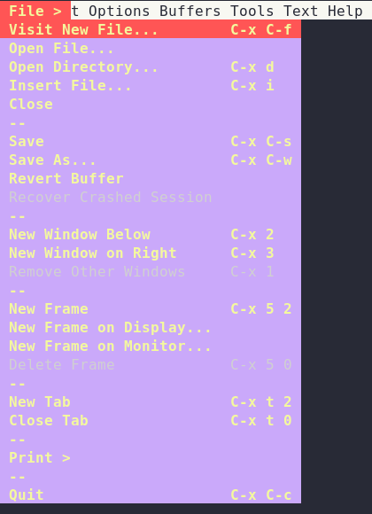

# Webserver Exercise - MSD20 SS22

In this exercise, we will configure two popular webserver. [Apache](https://httpd.apache.org/docs/2.4/) and [Nginx](https://docs.nginx.com/nginx/admin-guide/installing-nginx/installing-nginx-open-source/).

> You will work an a prepared virtual machine on our internal openstack infrastructure. Please check out [Moodle](https://elearning.fh-joanneum.at/course/view.php?id=2772#section-5) for details.

For this purpose we have prepared a series of configuration examples for you, which build on each other. You should be able to solve these independently based on your previous knowledge from past semesters. 

Should you not be able to solve the problem on your own, we will of course be at your side in lab (or via MS Teams) during the practice period. If you have questions about this exercise at a later time, please contact us via mail or MS Teams.

You are basically free to choose the order in which you carry out the exercises. Our plan would be Apache first and then Nginx. Finally the combined exercise, which includes both servers and Nodejs.

The exercises also contain some *optional* parts, which are primarily intended for those who can quickly get through the guided parts.

> Before you begin, make sure you are [prepared](./sections/00_prerequisites.md), so that you can easily access the configured web pages with your browser!

> **CHECKPOINT**: You will find multiple **CHECKPOINTS** during this exercise. When you pass that checkpoint, ask your lecturer to check your steps to get points for grading.

***

## Editors
To edit the configuration files, you need an editor. Because you will be connected via `ssh`, you have to use a command-line-editor!

The virtual machine has installed:
* [nano](https://www.nano-editor.org/)
* [vim](https://www.vim.org/)
* [emacs](https://www.gnu.org/software/emacs/)

When you not familiar with any of them, use [`nano`](#nano)!

### Save and exit editor
#### `nano`
* Save: `<Ctrl>o`
* Exit: `<Ctrl>x`

#### `vim`
* Save: `<Esc> :w <Enter>`
* Save and Exit: `<Esc> :wq! <Enter>`
* Exit (without saving): `<Esc> :q! <Enter>`

To enter "insert"-Mode, press `i`

#### `emacs`
* Save: `<Ctrl>x <Ctrl>s`
* Exit: `<Ctrl>x <Ctrl>c`

See also the menu (press `F10`)  

***

1. [Prerequisites](sections/00_prerequisites.md)
2. [Apache](sections/01_apache.md)
3. [Nginx](sections/02_nginx.md)
4. [HTTP Proxy](sections/03_proxy.md)

