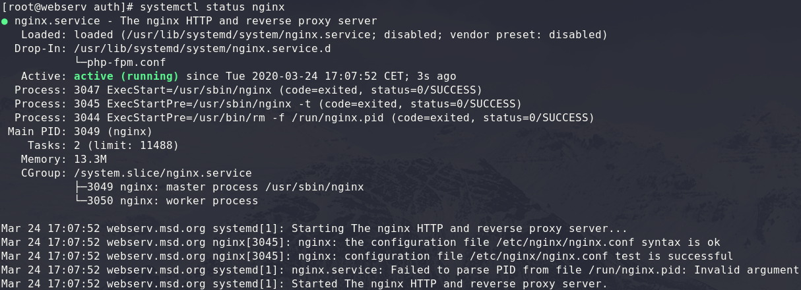

# Nginx configuration

After you set up apache webserver, we will take a look on another popular webserver, [nginx](https://docs.nginx.com/nginx/admin-guide/installing-nginx/installing-nginx-open-source/). When you just finished the apache exercise, please first stop apache webserver, otherwise you will cannot start nginx (because both will use at least port 80)!

> All commands and configurations in this exercise are to do as `root`!  
> Therefore, run all commands with `sudo` prepend, or switch to root with `sudo -i`!

```bash
systemctl status httpd
systemctl status nginx
```

For this exercise, start just nginx.

```bash
systemctl start nginx
```

> note that after a restart of your vm apache is stopped again

## Useful commands

**Start Nginx Webserver**
```bash
systemctl start nginx
```

**Stop Nginx Webserver**
```bash
systemctl stop nginx
```

**Check Nginx Configuration**
```bash
nginx -t
```

**Restart Nginx Webserver**
```bash
systemctl restart nginx
# better!
nginx -t && systemctl restart nginx
```

**Reload Nginx Webserver**
```bash
systemctl reload nginx
# better!
nginx -t && systemctl reload nginx
```

**Get Status of Nginx Webserver**
```bash
systemctl status nginx
```
***Stopped* Nginx**  


***Started* Nginx**


***

## Prerequisites

Before you start, take a look into the **[Prerequisites](./00_prerequisites.md)**, so that you can call the pages by there set up domain names!

***

## Server Blocks (VHost)
At first, we will configure some vhosts. You can choose any domain that you want, I will use `msd-webservice.at`

### Add custom configuration
On CentOS, you can find the central configuration file in `/etc/nginx/nginx.conf`. In the end, you would be able to set all configurations inside of that file, but that wouldn't be a good practice!  

Except in special situations you should also create separate configuration files. 

Especially for virtual hosts it is best practice to create a separate configuration file for each domain. In CentOS the folder `/etc/nginx/conf.d/` is intended for this purpose.

Create a new configuration for your custom domain (in my case *msd-webservice.at*).

```bash
vim /etc/nginx/conf.d/msd-webservice.at.conf
```

> all your custom configuration inside `/etc/nginx/conf.d/` **must** end with `.conf`, otherwise nginx will ignore them!

**/etc/nginx/conf.d/msd-webservice.at.conf**
```nginx
server {
  listen 80;
  server_name msd-webservice.at www.msd-webservice.at;

  root /var/www/msd-webservice.at/html;

  error_log  /var/www/msd-webservice.at/logs/error.log error;
  access_log /var/www/msd-webservice.at/logs/access.log;
}
```

> **What is the meaning of the rows?**
> ```nginx
> server {
> }
> ```
> The `server` block directive defines a virtual server (server block/virtual host). 
> ```nginx
> listen 80;
> ``` 
> The `listen` directive set up the port, which this server will listen on. The default http port is in this example optional, because this server will inherit all non set directives from the default one.
> ```nginx
> server_name msd-webservice.at www.msd-webservice.at;
> ```
> To handle just request for the domain `msd-webservice.at`, the `server_name` directive will be used. You can add multiple (sub)domains, simple separated by space.
> ```nginx
> root /var/www/msd-webservice.at/html;
> ```
> The `root` directive sets the location of our provided files. The root-folder of our server block.
> ```nginx
> error_log  /var/www/msd-webservice.at/logs/error.log error;
> access_log /var/www/msd-webservice.at/logs/access.log;
> ```
> With `error_log ... error`, we can set a custom location for error-logs, while `access_log` is for a custom location for the access-log. 

> **Additional Information**
> * [`server`](https://nginx.org/en/docs/http/ngx_http_core_module.html#server)
> * [`listen`](https://nginx.org/en/docs/http/ngx_http_core_module.html#listen)
> * [`server_name`](https://nginx.org/en/docs/http/ngx_http_core_module.html#server_name)
> * [`root`](https://nginx.org/en/docs/http/ngx_http_core_module.html#root)
> * [`error_log`](https://nginx.org/en/docs/ngx_core_module.html#error_log)
> * [`access_log`](https://nginx.org/en/docs/http/ngx_http_log_module.html#access_log)

> if you have already done the apache exercise and you use the same domain and `root` directory, you can [skip](#skip) this part.

Next, we need to create the expected folder-structure for our new virtual host. We need the `root`, as well as the folder for our log files.

```bash
mkdir -p /var/www/msd-webservice.at/html
mkdir -p /var/www/msd-webservice.at/logs
```

To ensure that a request without a specific file will returned, we need a `index.html` in our `root`. 

**Create a `index.html` with a custom content inside your set `root`.**

```tree
/var/www/msd-webservice.at/
├── html
│   └── index.html
└── logs
```

> The log files `error.log` and `access.log` do not have to be created manually. They will be created automatically by nginx!

<a id="skip" name="skip"></a>
When everything is correctly set up, we need to reload the nginx service once, so that it will re-read the configuration files and applies the changes. Before you reload the configuration, test if there are any errors, otherwise you will end with an crashed service or misconfigured server!

```bash
nginx -t && systemctl reload nginx
```

> When there is an error (e.g. typo) in your configuration, nginx may will stop on `reload`/`restart`. In that case, you need to fix the error and start the service again, because it will **stop** on error! (**Don't forget the `;` in the config!**)  
> But nginx will not stop on every error. When `systemctl reload nginx` takes several seconds and does not return an error message, this could also be a sign that something probably did not work. Check the **status** and look for *Warning* or *Error*.  
> Therefore, always test (`nginx -t`) the configuration before `reload`/`restart`!

When you get no error, you should be able to open your created website from your local computer. For example with Firefox.


***

#### Create a second Server Block

After you created your first **server** block, create a second one with another (sub)-domain. Don't forget to adapt your local `etc/hosts`!

***

### Custom ErrorDocument

Nginx has its own default error responses, for example when you try to get a resource that is not available.


You can set your own error responses inside your **server** configuration.

Extend your config...

```nginx
server {
  # ...

  error_page 403 /error/403.html;
  error_page 404 /error/404.html;
  error_page 500 502 /error/50x.html;

  # ...
}
```

> **What is the meaning of the rows?**
> 
> ```nginx
> error_page 404 /error/404.html;
> ```
> Whit the `error_page` directive, you can customize every HTTP error (4xx or 5xx) status output. In the example above, on **404** you will return the 404.html inside `/error/` sub-folder of your `root`!
> You can also define one `error_page` for multiple error-codes, as you can see for error 500 and 502 above.

> **Additional Information**
> * [`error_page`](https://nginx.org/en/docs/http/ngx_http_core_module.html#error_page)

Do make the additional configuration work, create the directory `error` inside you `root` and add the html-files for 404, 403 and 50x. Don't forget to `reload` the nginx-service!

```tree
/var/www/msd-webservice.at/
├── html
│   ├── error
│   │   ├── 403.html
│   │   ├── 404.html
│   │   └── 50x.html
│   └── index.html
└── logs
```

You can 404 easily test by trying to call up a path that does not exists. (e.g. *msd-webservice.at/not-exist*).

To test 403, simple try to call *msd-webservice.at/error*. Because there is no index.html inside, you will return the 403 error page.

To test the 5xx errors, we can create some custom location redirects. For that, edit your config and add the following lines.

```nginx
server {
  # ...

  location /5xx {
      fastcgi_pass unix:/non/existing/socket;
  }

  # ...
}
```

<a id="location" name="location"></a>

> **What is the meaning of the rows?**
> 
> ```nginx
> location /5xx { }
> ```
> With the `location` directive, we're able to customize the response for specific URI requests. In the simple example above, we look for *<your-domain.com>`/5xx`*. Inside the `location` block we define what should happen when this path is requested.
> ```nginx
> fastcgi_pass unix:/non/existing/socket;
> ```
> With the `fastcgi_pass` directive, we set the address of a FastCGI server. In the example above, we set a UNIX socket, that doesn't exists. And so, we will return a 500 HTTP error.

> **Additional Information**
> * [`location`](https://nginx.org/en/docs/http/ngx_http_core_module.html#location)
> * [`fastcgi_pass`](https://nginx.org/en/docs/http/ngx_http_fastcgi_module.html#fastcgi_pass)

### return and rewrite

With the directives `return` and `rewrite` we are able to manage incoming requests based on locations or self defined regular expressions.

For example, redirect paths that are no longer available, or change the request for further CGI processing.

First, we will redirect a path to an external website. For that, extend the config file of your **server**.

```nginx
server {
  # ...

  location /msd {
    return 302 https://www.fh-joanneum.at/msd;
  }

  # ...
}
```

> **What is the meaning of the rows?**
> 
> ```nginx
> return 302 https://www.fh-joanneum.at/msd;
> ```
> The `location` directive you already know from the [error example](#location). With `return`, we can return a custom HTTP status code, in this example [*302* (Found)](https://en.wikipedia.org/wiki/HTTP_302) and the redirect to an external url.

> **Additional Information**
> * [`return`](https://nginx.org/en/docs/http/ngx_http_rewrite_module.html#return)


With `rewrite`, we're able to change the request URI. For example, we have moved our media content internally into a different sub-folder.

**OLD**: http://msd-webservice.at/img/cat.png  
**NEW**: http://msd-webservice.at/media/img/cat.png

To understand the individual steps, first create the **OLD** structure.

1. create a directory `/img/` inside your `server`-`root`
2. place some pictures (at least one) into the new folder
 <!--* **TIP**: use `scp` to copy files from your local machine into the vm, e.g. `scp cat.png dog.png root@<ip-of-your-vm>:/var/www/msd-webservice.at/html/img/`-->
3. test if everything work well

```tree
/var/www/msd-webservice.at/
├── html
│   ├── error
│   │   └── ...
│   ├── img
│   │   ├── cat.jpg
│   │   └── dog.jpg
│   └── index.html
└── logs
```


Now, we want to move our `img` resources into the **NEW** location.

1. create a directory `/media/` inside your `server`-`root` and move the `/img/` directory into it.
```tree
├── html
│   ├── error
│   │   └── ...
│   ├── index.html
│   └── media
│       └── img
│           ├── cat.jpg
│           └── dog.jpg
└── logs
```
2. *What will happen now, when you open the **OLD** url?*
3. edit your `server` config and add a `rewrite`
```nginx
server {
  # ...

  rewrite ^/(img/.*)$ /media/$1;

  # ...
}
```
4. test if now everything works well (with the **OLD** URI, as well with the **NEW**!)

> **What is the meaning of the rows?**
> 
> ```nginx
> rewrite ^/(img/.*)$ /media/$1; 
> ```
> The `rewrite` directive takes as first parameter a regex and as second the replacement. In the example above, we are looking for `img/.*`. 
> *As you may remember from last semester, certain characters have a special meaning in regex. The dot (`.`) represents any character, the star (`*`) is a multiplier for any number of characters. The caret (`^`) at the beginning indicates the explicit start, the dollar (`$`) the end.
> With the round brackets (`()`) we form a group, which we can reused in form of `$1` for the replacement.*

> **Additional Information*
> * [`rewrite`](https://nginx.org/en/docs/http/ngx_http_rewrite_module.html#rewrite)

***

#### Rewrite

When enough time is left, take a look on the full [Module documentation](https://nginx.org/en/docs/http/ngx_http_rewrite_module.html#rewrite) of nginx and try other directives or experiment with additional `rewrite`s. If you find some nice examples, [share](https://teams.microsoft.com/l/channel/19%3a43f6ecf23d5c496f842679dde9527344%40thread.tacv2/General?groupId=d49e082b-d452-47ea-9ca3-ecd312610217&tenantId=714ce493-9d00-45e9-9d52-89dfa568262b)it with your colleges.

***

### htaccess

Nginx offers no alternative to apaches *.htaccess* and therefore no (easy) possibility to make further settings on user/folder level. The reason for this can be found [here](https://www.nginx.com/resources/wiki/start/topics/examples/likeapache-htaccess/).

***

### Basic Authentication

When enough time is left, take a look on the [basic authentication](https://docs.nginx.com/nginx/admin-guide/security-controls/configuring-http-basic-authentication/) tutorial of nginx and try to restrict the access to any desired `location`.

***


***

* [README](../README.md)
* [Prerequisites](00_prerequisites.md)
* [Apache](01_apache.md)
* [HTTP Proxy](03_proxy.md)
