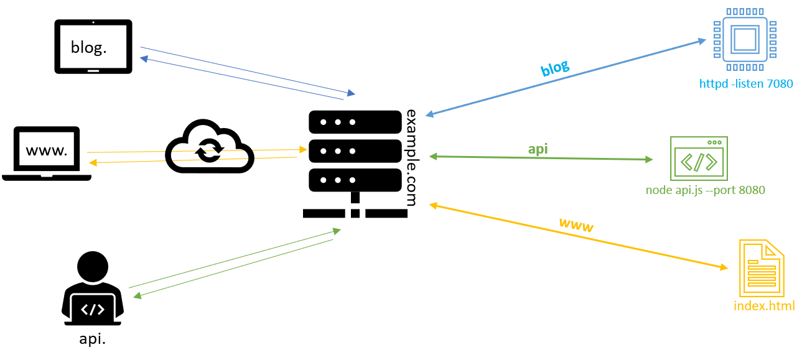
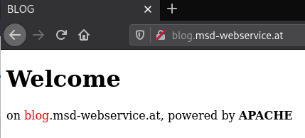

# HTTP Proxy

In this final exercise we will learn about the proxy functionality of webservers.
Both, apache and nginx can be configured as reverse proxy servers.
A reverse proxy forwards requests to other web servers.

Our goal is for nginx to accept all requests on port 80 and either return a static web page (*www*) based on the url, or forward the request to apache (*blog*) or nodejs (*api*).



## Prerequisites

For this exercise, we need at least 3 different (sub)-domains. I will choose <www.msd-webservice.at>, <blog.msd-webservice.at> and <api.msd-webservice.at> but you can choose whatever you want.

Add your chosen domains to your `etc/hosts` like described [here](00_prerequisites.md).

Also ensure that both nginx and apache are **stopped** at the beginning.

> All commands and configurations in this exercise are to do as `root`!  
> Therefore, run the commands with `sudo` prepend!

```bash
sudo systemctl stop nginx
sudo systemctl stop httpd
```

## Nginx configuration

Nginx will be our reverse proxy. Because of that, we have to do the most configuration work on it.

We need a separate `server`-block for **each** (sub)-domain.

Because I'm working with different sub-domains of *msd-webservice.at*, I will configure all blocks in one file. But you can also use different files for each.

### static html content (*www*)

First, I create a `server`-block for *www*. This will be straight forward like in the [Nginx Server Blocks](02_nginx.md#server-blocks-vhost) exercise.

```
server {
  server_name www.msd-webservice.at;

  root /var/www/www.msd-webservice.at/html;

  error_log  /var/www/www.msd-webservice.at/logs/error.log error;
  access_log /var/www/www.msd-webservice.at/logs/access.log;
}
```

Don't forget to create the expected folder-structure and add a nice *index.html*.

```tree
/var/www/www.msd-webservice.at/
├── html
│   └── index.html
└── logs
```

After you started nginx, you should be able to access your first website.


### proxy to apache (*blog*)

Next part is the `server`-block for the `proxy_pass` to apache.

```nginx
server {
  server_name blog.msd-webservice.at;

  location / {
    proxy_pass http://127.0.0.1:7080;
  }
}
```

> **What is the meaning of the rows?**
> ```nginx
> location / { }
> ```
> You already know what a [`location` directive](02_nginx.md#location) is used for. 
> ```nginx
> proxy_pass http://127.0.0.1:7080;
> ```
> The `proxy_pass` directive will redirect the given request to the proxied server. In our case, this server will be on the same machine and should lsiten on port *7080*.

> **Additional Information**
> * [`proxy_pass`](https://nginx.org/en/docs/http/ngx_http_proxy_module.html#proxy_pass)

After a server-reload, it wouldn't be work, because the apache webserver isn't configured and started at this point. You can do the [apache configuration](#apache-configuration) now or later.

### proxy to nodejs (*api*)

At least, we have to set up a `server`-block for the last (sub)-domain. This will look like the same as for [*blog*](#proxy-to-apache-blog), but instead of `http:127.0.0.1:7080` we will pass to `http:127.0.0.1:8080`, because our nodejs service will listen on port *8080* and also run on the same machine.

To make also the last (sub)-domain work, finish the [nodejs configuration](#node-configuration).


## Apache configuration

Before we configure our `VirtualHost`, we need to change the port apache is listen on. Per default, apache listens on port 80. When we start both, nginx and apache at the same time, at least one will crash, because it isn't possible to grab the same port for two processes!

For that, we need to change the apache ports configuration `/etc/apache2/ports.conf`.

**/etc/apache2/ports.conf**
```apache
# ...
Listen 7080

# ..
```
Somewhere in this configuration, you will find a line `Listen 80`. Change it to `Listen 7080`.  
To avoid troubles on https port (`443`), also change the line(s) `Listen 443` to `Listen 7443`.

Now we can start apache next to nginx without troubles.

Next, we need a configuration to respond something on request. For that, we will create a `VirtualHost` configuration like in the [apache](01_apache.md#vhost) exercise.

```apache
<VirtualHost *:7080>
  ServerName blog.msd-webservice.at

  DocumentRoot /var/www/blog.msd-webservice.at/html

  ErrorLog  /var/www/blog.msd-webservice.at/logs/error.log
  CustomLog /var/www/blog.msd-webservice.at/logs/access.log combined
</VirtualHost>
```

The main difference to the origin exercise, we need to set up the `VirtualHost` to listen on port *7080* as well.

Create the expected folder-structure and add a nice *index.html*. After you reload apache, you should get the expected website.

```tree
/var/www/blog.msd-webservice.at/
├── html
│   └── index.html
└── logs
```  



## Node configuration

The last part will be the nodejs application. We have already prepared for you a simple node app with express in `/srv/node/`, all that you need is to start it.

```bash
node /srv/node/index.js
```

If you want to run the nodejs application in background, simple add a `&` at the end. If you want to stop it, call `kill <pid>` (with the returned *pid* after the start) or simple `killall node` (*! attention, if several nodejs applications are running on the system, they will be **all** terminated!*)

We also provide a systemd-service for this node application, that you can run with the command `sudo systemctl start nodews.service`. Checkout [Custom Systemd-Service](../resources/node/systemd/) when you interested how that works.


***

* [README](../README.md)
* [Prerequisites](00_prerequisites.md)
* [Apache](01_apache.md)
* [Nginx](02_nginx.md)